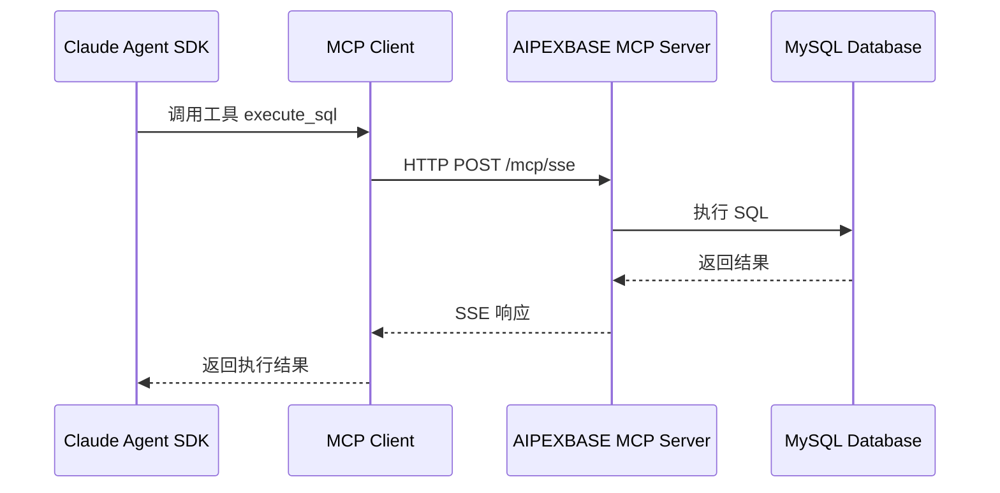

# MCP 服务器集成完整指南

## 概述

MCP (Model Context Protocol) 是 Anthropic 提供的协议,允许 Claude Agent 通过工具调用访问外部服务。本文档详细说明如何在 Genie 项目中集成 AIPEXBASE MCP 服务器。

## 什么是 MCP 服务器？

### 核心概念

**MCP 服务器** = 为 Claude Agent 提供特定功能的外部服务

在本项目中,AIPEXBASE MCP 服务器为 Agent 提供:
- 📊 数据库操作能力 (创建表、查询、更新)
- 🔍 表结构查询能力
- 🚀 API 端点管理能力

### 工作原理



## 可用 MCP 工具

### 1. execute_sql

执行 SQL 语句(CREATE, SELECT, UPDATE, DELETE)。

**工具签名**:
```json
{
    "name": "execute_sql",
    "description": "在 AIPEXBASE 项目中执行 SQL 语句",
    "parameters": {
        "sql": {
            "type": "string",
            "description": "要执行的 SQL 语句"
        },
        "project_id": {
            "type": "string",
            "description": "AIPEXBASE 项目 ID"
        }
    }
}
```

**使用示例**:
```python
# Agent 调用示例
await client.use_tool("execute_sql", {
    "sql": "CREATE TABLE IF NOT EXISTS tasks (id BIGINT PRIMARY KEY AUTO_INCREMENT, title VARCHAR(255), completed BOOLEAN DEFAULT false)",
    "project_id": "123"
})
```

**返回值**:
```json
{
    "success": true,
    "message": "SQL executed successfully",
    "affected_rows": 0
}
```

### 2. list_tables

列出项目中的所有数据库表。

**工具签名**:
```json
{
    "name": "list_tables",
    "description": "列出 AIPEXBASE 项目中的所有数据库表",
    "parameters": {
        "project_id": {
            "type": "string",
            "description": "AIPEXBASE 项目 ID"
        }
    }
}
```

**使用示例**:
```python
# Agent 调用示例
await client.use_tool("list_tables", {
    "project_id": "123"
})
```

**返回值**:
```json
{
    "tables": [
        {
            "name": "users",
            "description": "用户表",
            "columns_count": 8
        },
        {
            "name": "tasks",
            "description": "任务表",
            "columns_count": 5
        }
    ]
}
```

### 3. list_dynamic_api

列出 AIPEXBASE 自动生成的 RESTful API 端点。

**工具签名**:
```json
{
    "name": "list_dynamic_api",
    "description": "列出 AIPEXBASE 项目的自动生成 API",
    "parameters": {
        "project_id": {
            "type": "string",
            "description": "AIPEXBASE 项目 ID"
        }
    }
}
```

**使用示例**:
```python
# Agent 调用示例
await client.use_tool("list_dynamic_api", {
    "project_id": "123"
})
```

**返回值**:
```json
{
    "apis": [
        {
            "table": "users",
            "endpoints": {
                "list": "GET /api/v1/users",
                "create": "POST /api/v1/users",
                "update": "PUT /api/v1/users/:id",
                "delete": "DELETE /api/v1/users/:id"
            }
        }
    ]
}
```

## MCP 配置方式

### 方式 1: 自动配置(推荐)

`agent_runner.py` 在创建 Sandbox 时自动配置 MCP 服务器。

**配置位置**: `src/agent_runner.py` 行 245-260

```python
# 在 Sandbox 中添加 MCP 服务器配置
mcp_cmd = (
    'claude mcp add --transport sse --scope user '
    'aipexbase-mcp-server "http://39.106.253.201:8081/mcp/sse?token=kf_api_xxx"'
)

mcp_result = await manager.sandbox.commands.run(
    cmd=mcp_cmd,
    on_stdout=lambda msg: print(f"[MCP] {msg}"),
    on_stderr=lambda msg: print(f"[MCP Error] {msg}"),
    timeout=30
)

if mcp_result.exit_code == 0:
    print("✅ MCP 服务器配置成功")
else:
    print(f"⚠️  MCP 配置失败 (退出码: {mcp_result.exit_code})")
```

**优点**:
- ✅ 无需手动配置
- ✅ 每次运行自动重新配置
- ✅ 适合开发和测试

**缺点**:
- ⚠️ MCP URL 硬编码在代码中
- ⚠️ Token 暴露在代码中(安全隐患)

**改进方案**:

将 MCP URL 改为从环境变量读取:

```python
# 改进后的代码
import os

mcp_url = os.getenv(
    "AIPEXBASE_MCP_URL",
    "http://default-server:8080/mcp/sse?token=xxx"
)

mcp_cmd = f'claude mcp add --transport sse --scope user aipexbase-mcp-server "{mcp_url}"'
```

然后在 `.env` 中配置:
```bash
AIPEXBASE_MCP_URL=http://your-server:8080/mcp/sse?token=your_token
```

### 方式 2: Template 配置

在 `sandbox_claude_template.py` 中将 MCP 配置作为启动命令。

**配置位置**: `src/templates/sandbox_claude_template.py`

```python
template = (
    Template()
    # ... 其他配置 ...
    .set_start_cmd(
        """
        echo "=== Environment Version Check ===" && \
        python --version && \
        node --version && \
        claude mcp add --transport sse --scope user \
        aipexbase-mcp-server "http://server:port/mcp/sse?token=xxx" && \
        claude mcp list
        """,
        wait_for_timeout(10_000)  # 增加超时时间
    )
)
```

**优点**:
- ✅ MCP 配置在 Sandbox 创建时就完成
- ✅ 所有基于此 Template 的 Sandbox 都自动配置

**缺点**:
- ⚠️ 修改配置需要重新构建 Template
- ⚠️ 仍然存在 Token 硬编码问题

**最佳实践**:

结合环境变量:

```python
import os
from dotenv import load_dotenv

load_dotenv()

mcp_url = os.getenv("AIPEXBASE_MCP_URL", "")

template = (
    Template()
    .set_envs({
        "AIPEXBASE_MCP_URL": mcp_url
    })
    .set_start_cmd(
        """
        claude mcp add --transport sse --scope user \
        aipexbase-mcp-server "$AIPEXBASE_MCP_URL" && \
        claude mcp list
        """,
        wait_for_timeout(10_000)
    )
)
```

### 方式 3: 手动配置

在 Sandbox 运行后手动添加 MCP 服务器。

**步骤**:

1. 进入 Sandbox (通过 E2B Dashboard 或 SSH)
2. 运行 MCP 添加命令:
```bash
claude mcp add --transport sse --scope user \
  aipexbase-mcp-server "http://server:port/mcp/sse?token=xxx"
```

3. 验证配置:
```bash
claude mcp list
```

**优点**:
- ✅ 灵活,可以随时修改
- ✅ 适合调试和测试

**缺点**:
- ❌ Sandbox 重启后配置丢失
- ❌ 不适合自动化流程

## 获取 MCP URL

### 使用 aipexbase.py 自动创建

这是获取 MCP URL 的推荐方式。

```bash
# 1. 配置 .env 文件
AIPEXBASE_BASE_URL=http://your-server:8080
AIPEXBASE_ADMIN_EMAIL=admin@example.com
AIPEXBASE_ADMIN_PASSWORD=your_password

# 2. 运行创建脚本
python src/aipexbase.py "我的项目"

# 3. 从输出中复制 MCP URL
```

**输出示例**:
```
✅ 项目创建成功
📋 项目信息:
   项目 ID: 123
   项目名称: 我的项目
   API 密钥 ID: 456
🔌 MCP 配置:
   MCP URL: http://39.106.253.201:8081/mcp/sse?token=kf_api_fi682D2UVVgyj9UlaKUo1NeMvhNE1zQn

💡 使用提示:
   将 MCP URL 配置到 agent_runner.py 第 247 行
```

### 手动创建项目

1. 访问 AIPEXBASE 管理后台
2. 创建新项目
3. 生成 API 密钥
4. 复制 MCP SSE URL

## 配置验证

### 验证 MCP 服务器是否添加成功

**方法 1: 查看日志**

运行应用时观察日志输出:

```
🔧 配置 MCP 服务器...
[MCP] Added MCP server 'aipexbase-mcp-server'
[MCP] Server configuration:
[MCP]   Transport: sse
[MCP]   Scope: user
[MCP]   URL: http://server:port/mcp/sse?token=***
✅ MCP 服务器配置成功
```

**方法 2: 在 Sandbox 中验证**

```bash
# 列出已配置的 MCP 服务器
claude mcp list

# 预期输出:
# aipexbase-mcp-server (sse, user)
#   URL: http://server:port/mcp/sse?token=***
```

**方法 3: 测试工具调用**

```bash
# 在 Sandbox 中测试工具
claude --mcp-server aipexbase-mcp-server \
  "使用 list_tables 工具查询项目 123 的所有表"
```

### 常见配置问题

#### 问题 1: MCP 配置失败

```
[MCP Error] Failed to add MCP server
Error: Invalid URL format
```

**原因**: MCP URL 格式不正确

**解决方法**:
```bash
# ❌ 错误: 缺少协议
aipexbase-mcp-server "server:port/mcp/sse?token=xxx"

# ✅ 正确: 包含 http://
aipexbase-mcp-server "http://server:port/mcp/sse?token=xxx"
```

#### 问题 2: Token 认证失败

```
[MCP Error] Authentication failed: Invalid token
```

**原因**: Token 过期或无效

**解决方法**:
1. 重新生成 API 密钥
2. 更新 MCP URL 中的 Token
3. 重新配置 MCP 服务器

#### 问题 3: 连接超时

```
[MCP Error] Connection timeout
```

**原因**: AIPEXBASE 服务器不可访问

**解决方法**:
1. 检查 `AIPEXBASE_BASE_URL` 是否正确
2. 确认服务器可以从 E2B Sandbox 访问
3. 检查防火墙和网络配置

## Agent 中使用 MCP 工具

### 启用 MCP 工具

在 `ClaudeAgentOptions` 中添加 MCP 工具:

```python
from claude_agent_sdk import ClaudeAgentOptions

options = ClaudeAgentOptions(
    allowed_tools=[
        # 基础工具
        "Bash",
        "Read",
        "Write",
        "Glob",
        "Grep",

        # AIPEXBASE MCP 工具
        "execute_sql",      # 执行 SQL
        "list_tables",      # 列出表
        "list_dynamic_api"  # 列出 API
    ],
    permission_mode="bypassPermissions"
)
```

### 使用示例

#### 创建数据库表

```python
from claude_agent_sdk import ClaudeSDKClient, ClaudeAgentOptions
from prompt import append_prompt

async def create_database():
    options = ClaudeAgentOptions(
        allowed_tools=["execute_sql", "list_tables"],
        system_prompt={
            "type": "preset",
            "preset": "claude_code",
            "append": append_prompt
        }
    )

    async with ClaudeSDKClient(options) as client:
        await client.query(
            "创建一个用户表,包含 ID、用户名、邮箱、创建时间"
        )

        async for message in client.receive_response():
            print(message)

# 预期 Agent 行为:
# 1. 调用 execute_sql 创建表
# 2. 调用 list_tables 验证表已创建
# 3. 返回成功消息
```

#### 查询和使用 API

```python
async def generate_frontend():
    options = ClaudeAgentOptions(
        allowed_tools=["list_dynamic_api", "Write"],
        system_prompt={
            "type": "preset",
            "preset": "claude_code",
            "append": append_prompt
        }
    )

    async with ClaudeSDKClient(options) as client:
        await client.query(
            "生成一个 HTML 页面,使用 AIPEXBASE API 显示用户列表"
        )

        async for message in client.receive_response():
            print(message)

# 预期 Agent 行为:
# 1. 调用 list_dynamic_api 获取 API 端点
# 2. 生成前端代码,使用 aipexbase-js SDK
# 3. 调用 Write 工具保存 index.html
```

## 安全最佳实践

### 1. Token 管理

**❌ 不安全**:
```python
# 硬编码在代码中
mcp_url = "http://server/mcp/sse?token=kf_api_fi682D2UVVgyj9UlaKUo1NeMvhNE1zQn"
```

**✅ 安全**:
```python
# 从环境变量读取
import os
mcp_url = os.getenv("AIPEXBASE_MCP_URL")

# 或从配置文件读取
from dotenv import load_dotenv
load_dotenv()
mcp_url = os.getenv("AIPEXBASE_MCP_URL")
```

### 2. Token 轮换

定期轮换 API 密钥:

```bash
# 1. 在 AIPEXBASE 后台生成新的 API 密钥
# 2. 更新 .env 文件
AIPEXBASE_MCP_URL=http://server/mcp/sse?token=new_token

# 3. 重新构建 Template (如使用方式 2)
python scripts/build_template.py

# 4. 或重新启动应用 (如使用方式 1)
```

### 3. 权限控制

为不同环境使用不同的 API 密钥:

```bash
# .env.development
AIPEXBASE_MCP_URL=http://dev-server/mcp/sse?token=dev_token

# .env.production
AIPEXBASE_MCP_URL=https://prod-server/mcp/sse?token=prod_token
```

### 4. HTTPS 加密

生产环境必须使用 HTTPS:

```bash
# ❌ 开发环境 (可接受)
http://dev-server:8080/mcp/sse?token=xxx

# ✅ 生产环境 (必须)
https://prod-server.com/mcp/sse?token=xxx
```

## 性能优化

### 1. 连接池

AIPEXBASE MCP 服务器支持连接复用,避免频繁建立连接。

### 2. 批量操作

使用事务或批量 SQL 减少往返次数:

```python
# ❌ 低效: 多次调用
await client.use_tool("execute_sql", {"sql": "INSERT INTO users ..."})
await client.use_tool("execute_sql", {"sql": "INSERT INTO users ..."})
await client.use_tool("execute_sql", {"sql": "INSERT INTO users ..."})

# ✅ 高效: 批量插入
await client.use_tool("execute_sql", {
    "sql": """
        INSERT INTO users (username, email) VALUES
        ('user1', 'user1@example.com'),
        ('user2', 'user2@example.com'),
        ('user3', 'user3@example.com')
    """
})
```

### 3. 缓存查询结果

对于不常变化的数据(如表列表),Agent 可以缓存查询结果:

```python
# Agent 内部逻辑(由 prompt.py 指导)
# 1. 第一次调用 list_tables 获取表列表
# 2. 将结果缓存在会话中
# 3. 后续操作直接使用缓存,避免重复查询
```

## 故障排查

### 调试技巧

#### 1. 启用详细日志

```python
# 在 agent_runner.py 中增加日志
mcp_result = await manager.sandbox.commands.run(
    cmd=mcp_cmd,
    on_stdout=lambda msg: print(f"[MCP STDOUT] {msg}"),  # 详细输出
    on_stderr=lambda msg: print(f"[MCP STDERR] {msg}"),  # 错误输出
    timeout=30
)

print(f"[DEBUG] MCP Exit Code: {mcp_result.exit_code}")
print(f"[DEBUG] MCP Command: {mcp_cmd}")
```

#### 2. 测试 MCP 连接

```bash
# 在 Sandbox 中手动测试
curl -X POST "http://server:port/mcp/sse?token=xxx" \
  -H "Content-Type: application/json" \
  -d '{"method":"list_tables","params":{"project_id":"123"}}'
```

#### 3. 检查 Claude Code 配置

```bash
# 查看 Claude Code 的 MCP 配置文件
cat ~/.config/claude-code/mcp.json

# 或
claude mcp list --json
```

## 总结

MCP 服务器集成是 Genie 项目的核心功能,通过以下步骤完成配置:

1. ✅ 使用 `aipexbase.py` 创建项目并获取 MCP URL
2. ✅ 选择配置方式(自动/Template/手动)
3. ✅ 验证配置是否成功
4. ✅ 在 Agent 代码中启用 MCP 工具
5. ✅ 遵循安全最佳实践

**关键要点**:
- MCP 工具让 Agent 能够操作数据库
- 推荐使用自动配置 + 环境变量的方式
- 生产环境必须使用 HTTPS 和 Token 轮换
- 通过日志和测试验证配置

## 参考资源

- [PROMPT_GUIDE.md](PROMPT_GUIDE.md) - 系统提示词使用指南
- [QUICKSTART_FULL_STACK.md](QUICKSTART_FULL_STACK.md) - 全栈开发快速入门
- [AIPEXBASE_PYTHON_MODULE_GUIDE.md](AIPEXBASE_PYTHON_MODULE_GUIDE.md) - AIPEXBASE 模块完整使用指南
- [architecture.md](architecture.md) - 系统架构设计
