# Genie v1.0 产品演示文档

## 1. 产品概述

### 1.1 产品定位

**Genie** 是一个 AI 驱动的应用生成平台，用户通过自然语言描述需求，系统自动完成从需求分析、架构设计、代码生成、测试到云端部署的全流程，并返回可直接访问的应用链接。

### 1.2 核心价值主张

| 价值点               | 描述                                              | 用户收益                     |
| -------------------- | ------------------------------------------------- | ---------------------------- |
| **零代码启动** | 无需编写任何代码，通过对话即可生成完整应用        | 降低技术门槛，加速想法验证   |
| **专业级质量** | 多智能体协作 + 质量评估循环，确保输出符合工程标准 | 生成的代码可直接用于生产环境 |
| **即时部署**   | 自动部署到 E2B 沙箱，生成可分享的在线链接         | 无需配置服务器，即刻展示成果 |
| **可控可回溯** | 支持中断、恢复、回滚，用户全程掌控生成过程        | 灵活调整，降低试错成本       |

### 1.3 目标用户

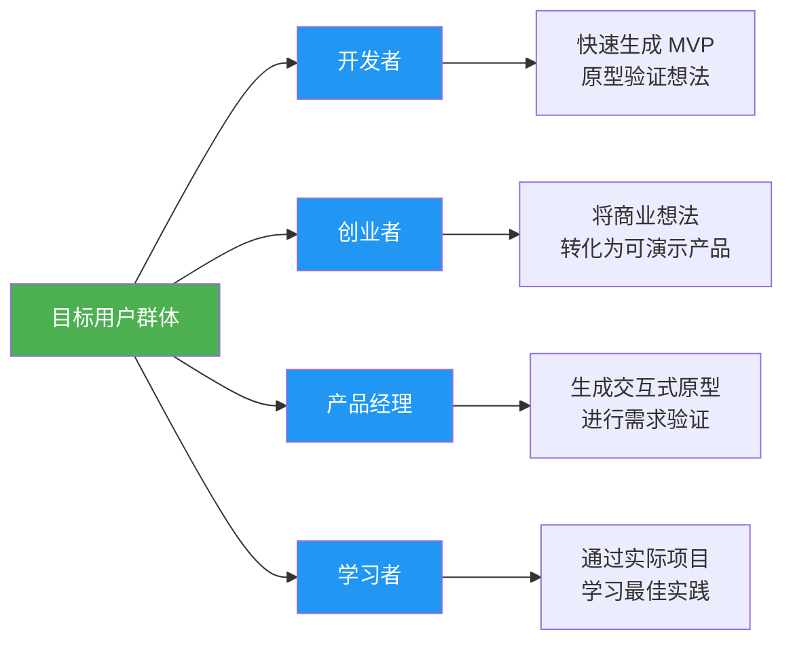

### 1.4 与竞品的差异化优势

| 对比维度           | Genie v1.0                     | 传统低代码平台       | 纯 AI 代码生成工具     |
| ------------------ | ------------------------------ | -------------------- | ---------------------- |
| **需求理解** | 多轮对话澄清，自动生成 PRD     | 需要用户自行整理需求 | 单次生成，无需求分析   |
| **架构设计** | AI 架构师自动设计技术栈        | 预设模板，灵活性受限 | 无架构设计，代码碎片化 |
| **质量保证** | 5 层 Reflect 评估 + 自动化测试 | 依赖手动测试         | 无质量保障机制         |
| **即时部署** | 自动部署到云端，返回链接       | 需手动部署配置       | 仅生成代码，不含部署   |
| **可回溯性** | 支持版本回滚和中断恢复         | 版本管理有限         | 无版本控制             |

---

## 2. 用户故事与使用场景

### 2.1 核心用户故事

#### US-01: 快速生成 Web 应用

> **作为** 一名创业者
> **我想要** 通过描述"一个任务管理工具"就能生成可用的 Web 应用
> **以便** 快速验证产品想法，无需雇佣开发团队

**验收标准**:

- ✅ 用户输入需求后，系统自动生成 PRD 文档
- ✅ 系统根据 PRD 设计技术架构（选择框架、数据库等）
- ✅ 系统生成完整的前后端代码
- ✅ 系统自动部署到云端并返回访问链接
- ✅ 整个流程在 15 分钟内完成

#### US-02: 多轮对话澄清需求

> **作为** 一名产品经理
> **我想要** 在需求分析阶段与 AI 进行多轮对话
> **以便** 确保 PRD 文档准确反映我的产品设想

**验收标准**:

- ✅ 需求分析智能体会主动提问澄清模糊点
- ✅ 用户可以修改或补充需求描述
- ✅ 系统会生成结构化的 PRD 文档供用户确认
- ✅ 只有用户确认后才进入下一阶段

#### US-03: 中断并恢复生成过程

> **作为** 一名开发者
> **我想要** 在代码生成过程中临时中断
> **以便** 处理其他紧急事务后继续生成

**验收标准**:

- ✅ 用户可以在任意时刻点击"中断"按钮
- ✅ 系统保存当前状态并停止执行
- ✅ 用户稍后可以从中断点继续执行
- ✅ 中断前已完成的工作不会丢失

#### US-04: 回滚到上一轮会话

> **作为** 一名用户
> **我想要** 回滚到上一轮成功部署的版本
> **以便** 撤销不满意的修改重新生成

**验收标准**:

- ✅ 系统记录每轮会话的完整状态
- ✅ 用户可以查看历史版本列表
- ✅ 点击"回滚"后，代码和状态恢复到指定版本
- ✅ Messages 历史也同步回滚

#### US-05: 查看实时进度和日志

> **作为** 一名用户
> **我想要** 实时查看每个智能体的工作进度
> **以便** 了解当前生成状态和预计完成时间

**验收标准**:

- ✅ 系统通过 AG-UI 事件推送当前执行的节点名称
- ✅ 系统推送每个智能体的流式输出（思考过程、生成的代码片段）
- ✅ 系统推送 Reflect 评估的分数和反馈
- ✅ 系统推送预计剩余时间

### 2.2 典型使用场景

#### 场景 A: 从零开始生成全新应用

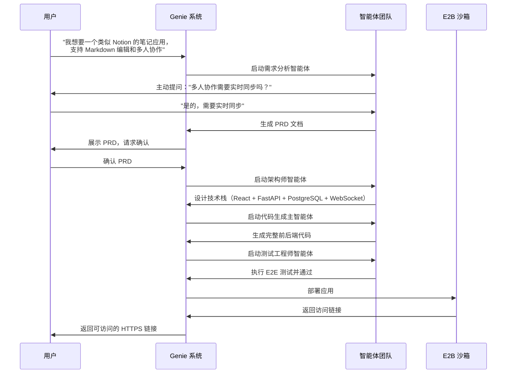

**时间线**: 约 12-15 分钟

#### 场景 B: 迭代优化已生成应用

1. 用户查看第一次生成的应用，发现 UI 不满意
2. 用户输入: "请将主题色改为蓝色，并增加夜间模式"
3. 系统识别这是修改请求，跳过需求分析和架构设计
4. 直接从代码生成阶段开始，修改样式代码
5. 重新测试和部署
6. 返回新版本链接

**时间线**: 约 3-5 分钟

#### 场景 C: 中断后恢复

```mermaid
graph TB
    Start([用户启动生成]) --> Progress[代码生成阶段<br/>进度 60%]
    Progress --> Interrupt[用户点击"中断"]
    Interrupt --> Save[系统保存 Checkpoint]
    Save --> Wait[用户离开 1 小时]
    Wait --> Return[用户返回点击"继续"]
    Return --> Resume[从 Checkpoint 恢复]
    Resume --> Continue[继续生成剩余代码]
    Continue --> Deploy[完成部署]

    style Start fill:#4caf50,color:#fff
    style Interrupt fill:#ff9800,color:#fff
    style Save fill:#2196f3,color:#fff
    style Resume fill:#2196f3,color:#fff
    style Deploy fill:#4caf50,color:#fff
```

#### 场景 D: 回滚到历史版本

1. **第一轮**: 用户生成了一个博客应用（版本 v1）
2. **第二轮**: 用户修改了评论功能（版本 v2）
3. **第三轮**: 用户发现 v2 有 bug，点击"回滚到 v1"
4. 系统将代码回滚到 v1 的 Git commit
5. 系统将 Messages 历史截断到 v1 结束时
6. 用户可以重新修改评论功能

---

## 3. 整体架构图

### 3.1 完整系统架构

```mermaid
graph TB
    subgraph "前端应用层"
        WebUI[Web 前端<br/>React/Vue]
        MobileUI[Mobile 前端<br/>React Native]
    end

    subgraph "AG-UI 通信层"
        WSServer[WebSocket Server<br/>连接管理 + 心跳保活]
        SSEServer[SSE Fallback Server<br/>单向事件流]
        EventConverter[事件转换器<br/>LangGraph → AG-UI]
        EventQueue[事件队列<br/>asyncio.Queue]
        Sequencer[事件排序器<br/>保证顺序性]
    end

    subgraph "后端服务层"
        RESTServer[REST API Server<br/>FastAPI]
        SessionMgr[会话管理器<br/>CRUD 操作]
        InterruptCtrl[中断控制器<br/>标志存储]
        RollbackCtrl[回滚控制器<br/>版本管理]
        AuthService[认证服务<br/>Bearer Token]
    end

    subgraph "LangGraph 编排层"
        StateGraph[StateGraph<br/>12 节点工作流]
        Checkpointer[Checkpointer<br/>状态快照]
        CondEdges[条件边逻辑<br/>Reflect 评分路由]
        InterruptCheck[中断检查<br/>节点级拦截]
    end

    subgraph "智能体执行层"
        ReqAgent[需求分析智能体<br/>Claude Agent SDK]
        ArchAgent[架构设计智能体<br/>Claude Agent SDK]
        CodeAgent[代码生成智能体<br/>Claude Agent SDK + MCP]
        TestAgent[测试工程师智能体<br/>Playwright MCP]
        DevOpsAgent[DevOps 智能体<br/>E2B SDK]
        Reflect1[Reflect 需求<br/>Sequential MCP]
        Reflect2[Reflect 架构<br/>Sequential MCP]
        Reflect3[Reflect 代码<br/>Linter + Type Checker]
        Reflect4[Reflect 测试<br/>覆盖率分析]
        Reflect5[Reflect 部署<br/>健康检查]
    end

    subgraph "基础设施层"
        Git[Git 版本控制<br/>每节点自动 commit]
        E2B[E2B Sandbox<br/>代码执行环境<br/>12 小时过期]
        PostgreSQL[(PostgreSQL<br/>状态持久化<br/>Checkpoint 存储)]
        Redis[(Redis<br/>Checkpoint 缓存<br/>中断标志存储)]
        Playwright[Playwright MCP<br/>浏览器自动化]
        Sequential[Sequential MCP<br/>结构化推理]
        Context7[Context7 MCP<br/>技术文档查询]
    end

    WebUI <-->|WebSocket| WSServer
    MobileUI <-->|WebSocket| WSServer
    WSServer <--> EventQueue
    SSEServer <--> EventQueue
    EventQueue <--> Sequencer
    Sequencer <--> EventConverter
    EventConverter <--> StateGraph

    WebUI -->|HTTPS REST| RESTServer
    RESTServer --> AuthService
    AuthService --> SessionMgr
    AuthService --> InterruptCtrl
    AuthService --> RollbackCtrl

    SessionMgr --> StateGraph
    InterruptCtrl --> Redis
    InterruptCtrl --> InterruptCheck
    RollbackCtrl --> Checkpointer
    RollbackCtrl --> Git

    StateGraph --> Checkpointer
    StateGraph --> InterruptCheck
    StateGraph --> CondEdges
    StateGraph --> ReqAgent
    StateGraph --> ArchAgent
    StateGraph --> CodeAgent
    StateGraph --> TestAgent
    StateGraph --> DevOpsAgent
    StateGraph --> Reflect1
    StateGraph --> Reflect2
    StateGraph --> Reflect3
    StateGraph --> Reflect4
    StateGraph --> Reflect5

    Checkpointer --> Redis
    Checkpointer --> PostgreSQL

    CodeAgent --> Git
    CodeAgent --> Context7
    TestAgent --> Playwright
    DevOpsAgent --> E2B
    Reflect1 --> Sequential
    Reflect2 --> Sequential
    Reflect3 --> Sequential
    Reflect4 --> Sequential
    Reflect5 --> Sequential

    style WebUI fill:#e1f5ff
    style WSServer fill:#fff9c4
    style RESTServer fill:#fff9c4
    style StateGraph fill:#c8e6c9
    style ReqAgent fill:#ffccbc
    style ArchAgent fill:#ffccbc
    style CodeAgent fill:#ffccbc
    style TestAgent fill:#ffccbc
    style DevOpsAgent fill:#ffccbc
    style Reflect1 fill:#ffe0b2
    style Reflect2 fill:#ffe0b2
    style Reflect3 fill:#ffe0b2
    style Reflect4 fill:#ffe0b2
    style Reflect5 fill:#ffe0b2
    style Git fill:#f8bbd0
    style E2B fill:#f8bbd0
    style PostgreSQL fill:#d1c4e9
    style Redis fill:#d1c4e9

```

**架构说明**:

- **前端应用层**: 由其他团队开发，通过 AG-UI Protocol 与后端通信
- **AG-UI 通信层**: Genie 项目核心，负责事件转换和实时推送
- **后端服务层**: FastAPI 提供 REST API 和会话管理
- **LangGraph 编排层**: 12 节点工作流编排引擎
- **智能体执行层**: 7 个专业智能体 + 5 个 Reflect 质量评估节点
- **基础设施层**: Git、E2B、数据库、MCP 工具集成

### 3.2 完整工作流拓扑图

```mermaid
graph TB
    START([开始]) --> Node1[1. 需求分析<br/>requirement_analysis<br/>Claude Agent SDK]
    Node1 --> Node2{2. Reflect 需求<br/>reflect_requirement<br/>Sequential MCP}

    Node2 -->|评分 >= 0.7<br/>通过| Node3[3. 架构设计<br/>architecture_design<br/>Claude Agent SDK]
    Node2 -->|评分 < 0.7<br/>且重试 < 3| Node1
    Node2 -->|重试 >= 3<br/>强制通过| Node3

    Node3 --> Node4{4. Reflect 架构<br/>reflect_architecture<br/>Sequential MCP}
    Node4 -->|评分 >= 0.7<br/>通过| Node5[5. 代码生成<br/>code_generation<br/>Claude Agent SDK + MCP]
    Node4 -->|评分 < 0.7<br/>且重试 < 3| Node3
    Node4 -->|重试 >= 3<br/>强制通过| Node5

    Node5 --> Node6{6. Reflect 代码<br/>reflect_code<br/>Linter + Type Checker}
    Node6 -->|评分 >= 0.7<br/>通过| Node7[7. E2E 测试<br/>e2e_testing<br/>Playwright MCP]
    Node6 -->|评分 < 0.7<br/>且重试 < 3| Node5
    Node6 -->|重试 >= 3<br/>强制通过| Node7

    Node7 --> Node8{8. Reflect 测试<br/>reflect_testing<br/>覆盖率分析}
    Node8 -->|评分 >= 0.7<br/>通过| Node9[9. 创建沙箱<br/>create_sandbox<br/>E2B SDK]
    Node8 -->|评分 < 0.7<br/>且重试 < 3| Node7
    Node8 -->|重试 >= 3<br/>强制通过| Node9

    Node9 --> Node10[10. 部署服务<br/>deploy_service<br/>E2B SDK]
    Node10 --> Node11{11. Reflect 部署<br/>reflect_deployment<br/>健康检查}

    Node11 -->|部署成功<br/>评分 >= 0.7| Node12([12. 结束<br/>END])
    Node11 -->|部署失败<br/>且重试 < 3| Node10
    Node11 -->|重试 >= 3<br/>记录警告| Node12

    style START fill:#4caf50,color:#fff
    style Node12 fill:#f44336,color:#fff
    style Node2 fill:#ff9800
    style Node4 fill:#ff9800
    style Node6 fill:#ff9800
    style Node8 fill:#ff9800
    style Node11 fill:#ff9800
    style Node1 fill:#2196f3,color:#fff
    style Node3 fill:#2196f3,color:#fff
    style Node5 fill:#2196f3,color:#fff
    style Node7 fill:#2196f3,color:#fff
    style Node9 fill:#2196f3,color:#fff
    style Node10 fill:#2196f3,color:#fff
```

**工作流特点**:

- **12 个节点**: 7 个智能体执行节点 + 5 个 Reflect 评估节点
- **条件边**: 每个 Reflect 节点后根据评分（0-1）决定下一步
- **自动重试**: 评分 < 0.7 时自动回退重试，最多 3 次
- **强制通过**: 重试 3 次后仍失败则记录警告并继续
- **Git Commit**: 每个节点执行完毕后自动提交代码
- **Checkpoint**: 每个节点后自动保存状态快照

---

## 4. 支持的功能

### 4.1 核心功能

#### F1: 自然语言需求输入

**功能描述**:

- 用户通过文本输入描述应用需求
- 支持上传参考文档（PDF、图片、URL）
- 支持语音输入（未来版本）

**技术实现**:

- FastAPI 端点接收用户输入
- 文件上传通过 multipart/form-data 处理
- 存储到 AgentState.user_input 字段

#### F2: 智能需求分析

**功能描述**:

- **需求分析智能体**通过多轮对话澄清需求
- 自动生成结构化 PRD 文档
- PRD 包含: 功能列表、用户故事、技术约束、非功能需求
- Reflect 节点评估 PRD 完整性（评分 > 0.7 通过）

**技术实现**:

- Claude Agent SDK 子智能体执行需求分析
- Sequential MCP 进行结构化推理和问题生成
- PRD 文档存储到 AgentState.requirement_doc (Markdown 格式)
- Reflect 节点使用 Sequential MCP 评估完整性

#### F3: 自动架构设计

**功能描述**:

- **架构师智能体**根据 PRD 设计技术架构
- 输出: 技术栈选型、系统架构图、数据模型、API 设计
- 考虑因素: 性能、可扩展性、开发复杂度
- Reflect 节点评估架构合理性

**技术实现**:

- Claude Agent SDK 子智能体进行架构设计
- Context7 MCP 查询框架最佳实践
- 架构文档存储到 AgentState.architecture_doc
- Reflect 节点评估技术栈兼容性和合理性

#### F4: 代码生成

**功能描述**:

- **代码生成主智能体**（基于 Claude Agent SDK）生成完整项目代码
- 支持的项目类型:
  - Web 应用（React/Vue + FastAPI/Express）
  - CLI 工具（Python/Node.js）
  - API 服务（FastAPI/Express）
- 自动生成单元测试代码
- Reflect 节点评估代码质量（Linter + Type Checker）

**技术实现**:

- Claude Agent SDK 主智能体生成代码
- MCP 工具用于文件读写和代码执行
- 代码文件存储到 AgentState.code_files (字典: 路径→内容)
- Git 自动 commit 每个生成的文件
- Reflect 节点运行 ESLint/Ruff/MyPy 进行质量检查

#### F5: 自动化测试

**功能描述**:

- **测试工程师智能体**执行 E2E 测试
- 使用 Playwright MCP 工具进行浏览器自动化测试
- 测试用例自动生成（覆盖核心用户流程）
- 测试失败时生成详细报告，回退到代码生成阶段重试
- Reflect 节点评估测试覆盖率和通过率

**技术实现**:

- Claude Agent SDK 子智能体编写测试用例
- Playwright MCP 执行浏览器自动化
- 测试结果存储到 AgentState.test_results
- Reflect 节点分析覆盖率报告（目标 > 70%）

#### F6: 云端部署

**功能描述**:

- 创建 E2B 沙箱（基于预定义模板）
- **DevOps 智能体**通过 E2B Python SDK 部署服务
- 自动配置环境变量、安装依赖、启动服务
- 返回可访问的 HTTPS 链接
- 沙箱过期时间: 12 小时
- Reflect 节点验证部署成功性（健康检查）

**技术实现**:

- E2B SDK 创建沙箱环境
- 上传代码文件到沙箱
- 执行部署脚本（npm install && npm start）
- 配置端口映射并生成访问链接
- 存储到 AgentState.access_url
- Reflect 节点执行 HTTP 健康检查

#### F7: 中断与恢复

**功能描述**:

- **中断机制**:
  - 接收客户端中断请求
  - 设置中断标志，LangGraph 在下个节点检查时停止
  - Claude Agent SDK 的 `interrupt()` 方法停止当前智能体的流式输出
  - 向客户端发送工作流完成事件（标记为中断状态）
- **恢复机制**:
  - 接收客户端恢复请求
  - 从 LangGraph checkpoint 恢复状态
  - 从中断节点继续执行

**技术实现**:

- Redis 存储中断标志 (key: `interrupt:{thread_id}`)
- 每个节点开始前检查中断标志
- 检测到中断后，Checkpointer 保存当前 AgentState
- 向客户端发送 `RUN_FINISHED` 事件 (outcome="interrupt")
- 恢复时从 Checkpointer 加载 AgentState 并继续执行

#### F8: 会话回滚

**功能描述**:

- **回滚粒度**: 会话轮次（session_round）
  - 第1轮: 初次生成
  - 第2轮: 第一次修改
  - 第3轮: 第二次修改
- **回滚机制**:
  1. 从 LangGraph checkpoint 恢复 AgentState
  2. 执行 Git 版本回滚
  3. 截断 Messages 历史到指定轮次
  4. 向客户端推送回滚后的状态信息
- **回滚限制**:
  - 如果还在需求分析阶段（未生成代码），无需回滚
  - 只能回滚到已完成部署的轮次

**技术实现**:

- PostgreSQL 存储每轮次的 Checkpoint ID 和 Git Commit ID
- 回滚时查询目标轮次的 Checkpoint 和 Commit
- 使用 `git reset --hard <commit>` 回滚代码
- 从数据库加载 AgentState 并截断 user_messages 数组
- 更新 session_round 字段

### 4.2 辅助功能

#### F9: 实时进度推送

**功能描述**:

- 推送当前执行节点名称（STEP_STARTED 事件）
- 推送节点进度百分比（CUSTOM 事件）
- 推送每个智能体的流式输出（TEXT_MESSAGE_CONTENT 事件）
- 推送 Reflect 评估结果（CUSTOM 事件）

**技术实现**:

- 事件转换器拦截 LangGraph 节点执行
- 生成 AG-UI 标准事件格式
- 通过 WebSocket 实时推送到前端
- 前端根据事件更新 UI 进度条和日志

#### F10: 历史版本管理

**功能描述**:

- 提供 API 获取所有会话轮次列表
- 提供每轮次的 Git commit 信息
- 支持通过 API 查询历史版本的 PRD、架构文档、代码
- 支持下载历史版本的完整项目

**技术实现**:

- `GET /api/sessions/{threadId}/versions` 返回版本列表
- 每个版本包含: session_round, git_commit, created_at, summary
- `GET /api/sessions/{threadId}/versions/{round}` 返回指定版本详情
- `GET /api/sessions/{threadId}/versions/{round}/download` 下载 ZIP 包

#### F11: 错误处理与重试

**功能描述**:

- 自动检测错误并重试（最多 3 次）
- 通过 AG-UI 事件推送详细的错误信息和调试日志
- 提供 API 支持手动重试失败的节点

**技术实现**:

- 每个节点包装在 try-except 块中
- 捕获异常后存储到 AgentState.error 和 error_node
- 发送 `RUN_ERROR` 事件到前端
- Reflect 节点评分 < 0.7 时自动重试
- 提供 `POST /api/sessions/{threadId}/retry` 手动重试端点

---

## 5. 技术架构

### 5.1 技术栈

#### 后端技术栈

| 技术分类             | 选型             | 版本     | 用途                       |
| -------------------- | ---------------- | -------- | -------------------------- |
| **编程语言**   | Python           | 3.12     | 后端开发主语言             |
| **Web 框架**   | FastAPI          | Latest   | REST API 和 WebSocket 服务 |
| **编排引擎**   | LangGraph        | >=0.2.74 | 工作流编排和状态管理       |
| **智能体框架** | Claude Agent SDK | >=0.1.5  | 子智能体开发               |
| **数据库**     | PostgreSQL       | 15+      | 生产环境状态持久化         |
| **缓存**       | Redis            | 7+       | Checkpoint 缓存、中断标志  |
| **版本控制**   | Git              | 2.40+    | 代码版本管理               |
| **沙箱环境**   | E2B              | >=2.6.4  | 代码执行和部署             |

#### MCP 工具集成

| MCP 服务器               | 版本   | 用途                       |
| ------------------------ | ------ | -------------------------- |
| **Playwright MCP** | Latest | 浏览器自动化测试           |
| **Sequential MCP** | Latest | 结构化推理（Reflect 评估） |
| **Context7 MCP**   | Latest | 技术文档查询（可选）       |

### 5.2 LangGraph 工作流设计

#### 节点类型说明

**智能体执行节点**（7 个）:

1. **需求分析节点** - 使用 Claude Agent SDK 进行需求澄清和 PRD 生成
2. **架构设计节点** - 使用 Claude Agent SDK 设计技术栈和系统架构
3. **代码生成节点** - 使用 Claude Agent SDK + MCP 工具生成完整代码
4. **E2E 测试节点** - 使用 Playwright MCP 执行浏览器自动化测试
5. **创建沙箱节点** - 使用 E2B SDK 创建云端执行环境
6. **部署服务节点** - 使用 E2B SDK 部署应用并配置访问链接

**Reflect 评估节点**（5 个）:

1. **需求评估节点** - 使用 Sequential MCP 评估 PRD 完整性
2. **架构评估节点** - 使用 Sequential MCP 评估架构合理性
3. **代码评估节点** - 运行 Linter 和 Type Checker 评估代码质量
4. **测试评估节点** - 分析测试覆盖率和通过率
5. **部署评估节点** - 执行健康检查验证部署成功性

#### 条件边决策逻辑

每个 Reflect 节点后的决策规则：

| Reflect 评分 | 重试次数 | 决策结果     | 说明                             |
| ------------ | -------- | ------------ | -------------------------------- |
| ≥ 0.7       | 任意     | 继续下一阶段 | 质量达标，通过评估               |
| < 0.7        | < 3      | 回退重试     | 质量不达标，返回上一节点         |
| < 0.7        | ≥ 3     | 强制通过     | 已达最大重试次数，记录警告后继续 |

#### 工作流构建过程

1. **创建图结构** - 定义 AgentState 状态对象
2. **添加节点** - 12 个节点（7 个智能体 + 5 个 Reflect）
3. **设置入口** - 从 requirement_analysis 节点开始
4. **添加边** - 连接节点之间的执行顺序
5. **添加条件边** - 根据 Reflect 评分决定路由方向
6. **设置终点** - reflect_deployment 节点后结束
7. **编译图** - 配置 PostgreSQL Checkpointer 进行状态持久化

### 5.3 中断机制设计

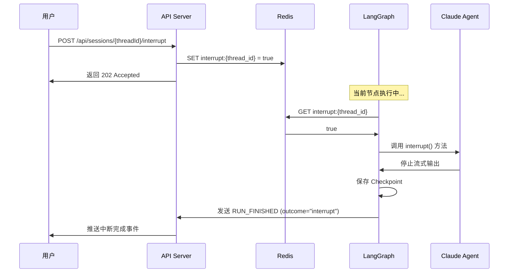

**中断检查点**:

- 每个节点开始前检查中断标志
- Claude Agent SDK 流式输出期间检查中断标志
- 检测到中断后，立即停止并保存状态

### 5.4 回滚机制设计

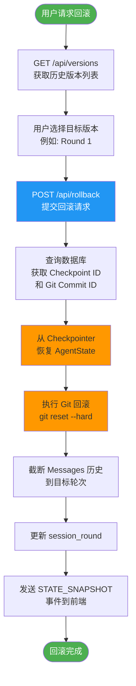

**回滚执行流程**:

1. 用户选择目标版本（session_round）
2. 查询数据库获取对应的 Checkpoint ID 和 Git Commit ID
3. 从 Checkpointer 恢复 AgentState
4. 执行 `git reset --hard <commit_id>`
5. 截断 user_messages 数组到目标轮次
6. 更新 session_round 字段
7. 向前端推送回滚后的完整状态

---

## 6. 数据模型

### 6.1 AgentState 核心字段

AgentState 是 LangGraph 工作流的核心状态对象，包含以下 15 个字段类别：

#### 会话元数据

| 字段名        | 类型   | 说明                   |
| ------------- | ------ | ---------------------- |
| thread_id     | 字符串 | 会话线程ID（UUID）     |
| run_id        | 字符串 | 当前运行ID（UUID）     |
| session_round | 整数   | 会话轮次（1, 2, 3...） |
| created_at    | 时间戳 | 创建时间               |
| updated_at    | 时间戳 | 更新时间               |

#### 用户输入

| 字段名        | 类型   | 说明                               |
| ------------- | ------ | ---------------------------------- |
| user_input    | 字符串 | 用户的需求描述                     |
| user_messages | 列表   | 完整的 Messages 历史（AG-UI 格式） |

**user_messages 结构示例**:

```json
[
  {
    "id": "msg_001",
    "role": "user",
    "content": "我想要一个任务管理工具",
    "timestamp": "2025-11-12T10:00:00Z"
  },
  {
    "id": "msg_002",
    "role": "assistant",
    "content": "请问需要支持团队协作吗？",
    "timestamp": "2025-11-12T10:00:05Z"
  }
]
```

#### 项目信息

| 字段名         | 类型   | 说明                                       |
| -------------- | ------ | ------------------------------------------ |
| project_name   | 字符串 | 项目名称（如 "task-manager"）              |
| project_folder | 字符串 | 项目文件夹名称                             |
| project_path   | 字符串 | 完整项目路径（绝对路径）                   |
| project_type   | 字符串 | 项目类型（web_app, cli_tool, api_service） |

#### Git 版本控制

| 字段名             | 类型   | 说明                    |
| ------------------ | ------ | ----------------------- |
| git_initialized    | 布尔值 | 是否已初始化 Git        |
| git_current_commit | 字符串 | 当前 commit ID（SHA-1） |
| git_history        | 列表   | Git 历史记录            |

**git_history 结构示例**:

```json
[
  {
    "node": "requirement_analysis",
    "commit_id": "a1b2c3d4",
    "message": "Add PRD document",
    "timestamp": "2025-11-12T10:05:00Z"
  },
  {
    "node": "code_generation",
    "commit_id": "e5f6g7h8",
    "message": "Generate complete codebase",
    "timestamp": "2025-11-12T10:10:00Z"
  }
]
```

#### E2B 沙箱

| 字段名             | 类型   | 说明                     |
| ------------------ | ------ | ------------------------ |
| sandbox_id         | 字符串 | E2B 沙箱ID               |
| sandbox_url        | 字符串 | 沙箱访问链接（内部）     |
| sandbox_expires_at | 时间戳 | 沙箱过期时间（12小时后） |
| deployment_port    | 整数   | 部署端口号（如 3000）    |
| access_url         | 字符串 | 最终访问链接（HTTPS）    |

#### 智能体输出文档

| 字段名           | 类型   | 说明                          |
| ---------------- | ------ | ----------------------------- |
| requirement_doc  | 字符串 | PRD 文档内容（Markdown 格式） |
| architecture_doc | 字符串 | 架构设计文档（Markdown 格式） |
| code_files       | 字典   | 生成的代码文件（路径→内容）  |
| test_results     | 字典   | 测试结果                      |
| deployment_logs  | 列表   | 部署日志                      |

**code_files 结构示例**:

```json
{
  "src/app.py": "from fastapi import FastAPI\n\napp = FastAPI()\n...",
  "src/models/user.py": "from pydantic import BaseModel\n...",
  "tests/test_app.py": "import pytest\n..."
}
```

#### Reflect 评估结果

| 字段名          | 类型 | 说明                                                          |
| --------------- | ---- | ------------------------------------------------------------- |
| reflect_results | 字典 | 各阶段评估结果（包含 score, feedback, decision, retry_count） |

**reflect_results 结构示例**:

```json
{
  "reflect_requirement": {
    "score": 0.85,
    "feedback": "PRD 文档完整，功能需求清晰，建议补充性能指标",
    "decision": "pass",
    "retry_count": 0
  },
  "reflect_code": {
    "score": 0.72,
    "feedback": "代码质量良好，已通过 Linter 检查，存在 2 个类型警告",
    "decision": "pass",
    "retry_count": 1
  }
}
```

#### 工作流状态

| 字段名           | 类型   | 说明               |
| ---------------- | ------ | ------------------ |
| current_node     | 字符串 | 当前执行的节点名称 |
| completed_nodes  | 列表   | 已完成的节点列表   |
| node_start_times | 字典   | 节点开始时间       |
| node_end_times   | 字典   | 节点结束时间       |

#### 中断和错误处理

| 字段名              | 类型           | 说明           |
| ------------------- | -------------- | -------------- |
| interrupt_requested | 布尔值         | 是否请求中断   |
| interrupt_reason    | 字符串         | 中断原因       |
| error               | 字符串（可选） | 错误信息       |
| error_node          | 字符串（可选） | 发生错误的节点 |

#### 回滚相关

| 字段名                | 类型         | 说明               |
| --------------------- | ------------ | ------------------ |
| checkpoint_id         | 字符串       | 当前 checkpoint ID |
| rollback_available    | 布尔值       | 是否可回滚         |
| rollback_target_round | 整数（可选） | 回滚目标轮次       |

#### 执行日志

| 字段名 | 类型 | 说明                                                           |
| ------ | ---- | -------------------------------------------------------------- |
| logs   | 列表 | 执行日志数组（每条包含 timestamp、level、node、message、data） |

**logs 结构示例**:

```json
[
  {
    "timestamp": "2025-11-12T10:00:00Z",
    "level": "INFO",
    "node": "requirement_analysis",
    "message": "开始需求分析",
    "data": {}
  },
  {
    "timestamp": "2025-11-12T10:00:10Z",
    "level": "DEBUG",
    "node": "requirement_analysis",
    "message": "生成 PRD 文档",
    "data": {"doc_length": 1500}
  }
]
```

### 6.2 数据流转示意图

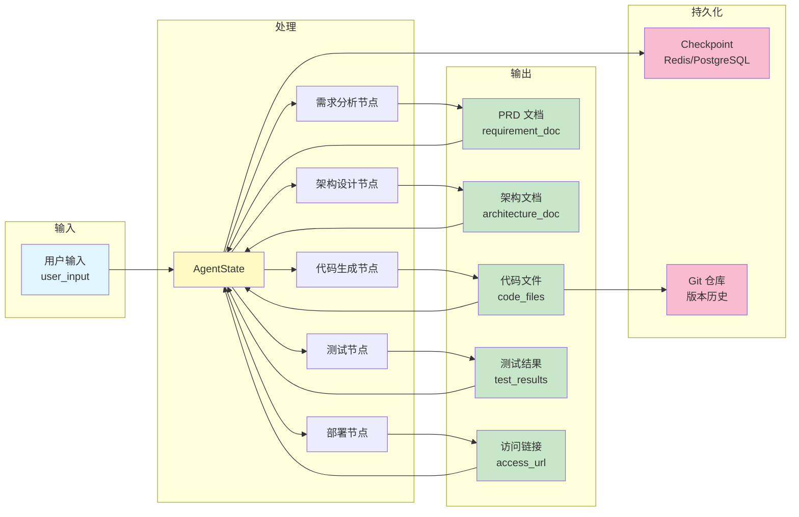

---

## 7. 通信协议规范

### 7.1 AG-UI Protocol 架构概述

**AG-UI Protocol** 是 CopilotKit 开发的开源协议，用于标准化 AI 智能体与前端应用之间的交互。

**核心设计理念**:

- **事件驱动**: 所有通信基于事件流，支持实时更新
- **双向通信**: 支持 WebSocket 双向通信和 SSE 单向流
- **状态同步**: 自动同步 Messages 历史和 AgentState
- **可扩展性**: 支持自定义事件类型（CUSTOM 事件）

**Genie 的集成策略**:

- Genie 后端实现 AG-UI Server，负责事件转换和推送
- 前端团队基于 AG-UI Client SDK（React/Vue）接收事件并更新 UI
- 双方通过 AG-UI Protocol 规范进行对接，无需定制化协议

### 7.2 AG-UI 事件类型体系

AG-UI Protocol 定义了 16 种标准事件类型，分为 5 大类：

#### 生命周期事件

| 事件类型          | 触发时机     | 数据字段                              |
| ----------------- | ------------ | ------------------------------------- |
| `RUN_STARTED`   | 工作流启动   | threadId, runId, timestamp            |
| `STEP_STARTED`  | 节点开始执行 | stepName, stepId, timestamp           |
| `STEP_FINISHED` | 节点执行完成 | stepName, stepId, duration, timestamp |
| `RUN_FINISHED`  | 工作流完成   | result, outcome, timestamp            |
| `RUN_ERROR`     | 执行错误     | message, code, node, retryable        |

#### 消息事件

| 事件类型                 | 触发时机   | 数据字段                           |
| ------------------------ | ---------- | ---------------------------------- |
| `TEXT_MESSAGE_START`   | 开始新消息 | messageId, role, timestamp         |
| `TEXT_MESSAGE_CONTENT` | 流式内容块 | messageId, delta, timestamp        |
| `TEXT_MESSAGE_END`     | 消息结束   | messageId, finishReason, timestamp |

#### 工具调用事件

| 事件类型            | 触发时机         | 数据字段                            |
| ------------------- | ---------------- | ----------------------------------- |
| `TOOL_CALL_START` | 工具调用开始     | toolCallId, toolCallName, timestamp |
| `TOOL_CALL_ARGS`  | 工具参数（流式） | toolCallId, argsDelta, timestamp    |
| `TOOL_CALL_END`   | 工具调用结束     | toolCallId, result, timestamp       |

#### 状态管理事件

| 事件类型              | 触发时机     | 数据字段                           |
| --------------------- | ------------ | ---------------------------------- |
| `STATE_SNAPSHOT`    | 完整状态快照 | state (完整 AgentState), timestamp |
| `STATE_DELTA`       | 增量状态更新 | delta (JSON Patch 格式), timestamp |
| `MESSAGES_SNAPSHOT` | 完整消息历史 | messages (完整数组), timestamp     |

#### 自定义事件

| 事件类型   | 触发时机   | 数据字段                               |
| ---------- | ---------- | -------------------------------------- |
| `CUSTOM` | 自定义场景 | eventName, data (任意 JSON), timestamp |

**Genie 使用的自定义事件**:

- `CUSTOM.progress`: 节点进度百分比
- `CUSTOM.reflect_score`: Reflect 评估分数和反馈
- `CUSTOM.git_commit`: Git commit 信息

### 7.3 事件流转换架构设计

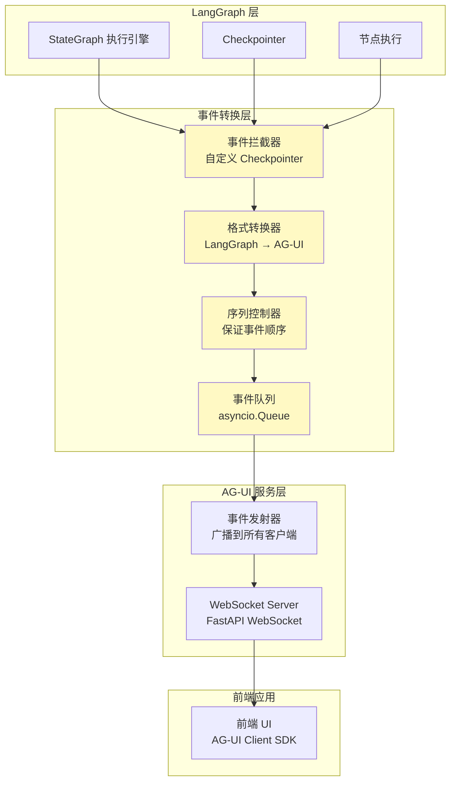

**转换逻辑说明**（架构设计概念）:

事件转换管道负责以下职责：

1. **拦截 LangGraph 事件**

   - 通过自定义 Checkpointer 继承 PostgreSqlSaver
   - 重写状态更新方法拦截节点执行事件
   - 在节点函数中手动发送事件
2. **转换为 AG-UI 格式**

   - 节点开始 → STEP_STARTED
   - 节点完成 → STEP_FINISHED
   - 状态更新 → STATE_SNAPSHOT / STATE_DELTA
   - Agent 输出 → TEXT_MESSAGE_CONTENT
   - Reflect 评分 → CUSTOM
3. **保证事件顺序**

   - 每个事件附加序列号（sequenceNumber）
   - 使用优先级队列排序
   - 客户端侧检测并重组乱序事件
4. **推送到 WebSocket**

   - FastAPI WebSocket 管理所有活跃连接
   - 广播事件到对应 thread_id 的所有客户端
   - 处理连接断开和自动重连

### 7.4 Claude Agent SDK 集成策略

**Agent 流式输出到 AG-UI 事件的映射**:

| Claude Agent SDK 输出   | AG-UI 事件类型       | 转换说明                           |
| ----------------------- | -------------------- | ---------------------------------- |
| AssistantMessage (首次) | TEXT_MESSAGE_START   | 生成新 messageId (UUID)            |
| TextBlock (增量)        | TEXT_MESSAGE_CONTENT | 计算文本增量 (delta)               |
| TextBlock (完成)        | TEXT_MESSAGE_END     | 标记 finishReason = "stop"         |
| ToolUseBlock (开始)     | TOOL_CALL_START      | 生成 toolCallId, 记录 toolCallName |
| ToolUseBlock (参数流式) | TOOL_CALL_ARGS       | 流式传输 JSON 参数增量             |
| ToolResultBlock         | TOOL_CALL_END        | 附带工具执行结果                   |

**集成架构说明**:

Claude Agent SDK 流式输出的处理流程：

1. **初始化流式会话**

   - Agent SDK 返回异步迭代器
   - 生成唯一的 messageId（UUID）
2. **发送消息开始事件**

   - 发送 TEXT_MESSAGE_START 事件
   - 标记消息角色为 "assistant"
3. **处理流式内容**

   - **文本块处理**：实时计算文本增量（delta），发送 TEXT_MESSAGE_CONTENT 事件
   - **工具调用处理**：识别工具调用开始，发送 TOOL_CALL_START 和 TOOL_CALL_ARGS 事件
4. **结束消息**

   - 发送 TEXT_MESSAGE_END 事件
   - 标记 finishReason 为 "stop"

**工具调用生命周期管理**:

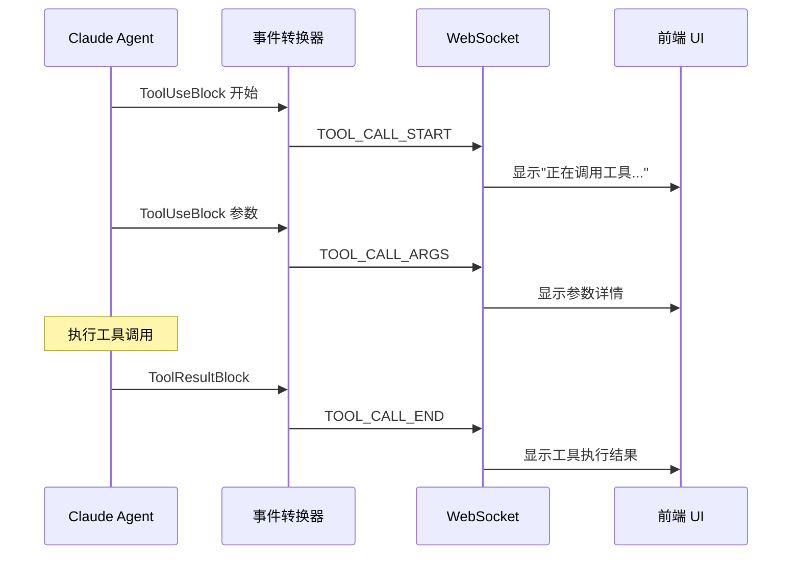

### 7.5 完整事件流时间线

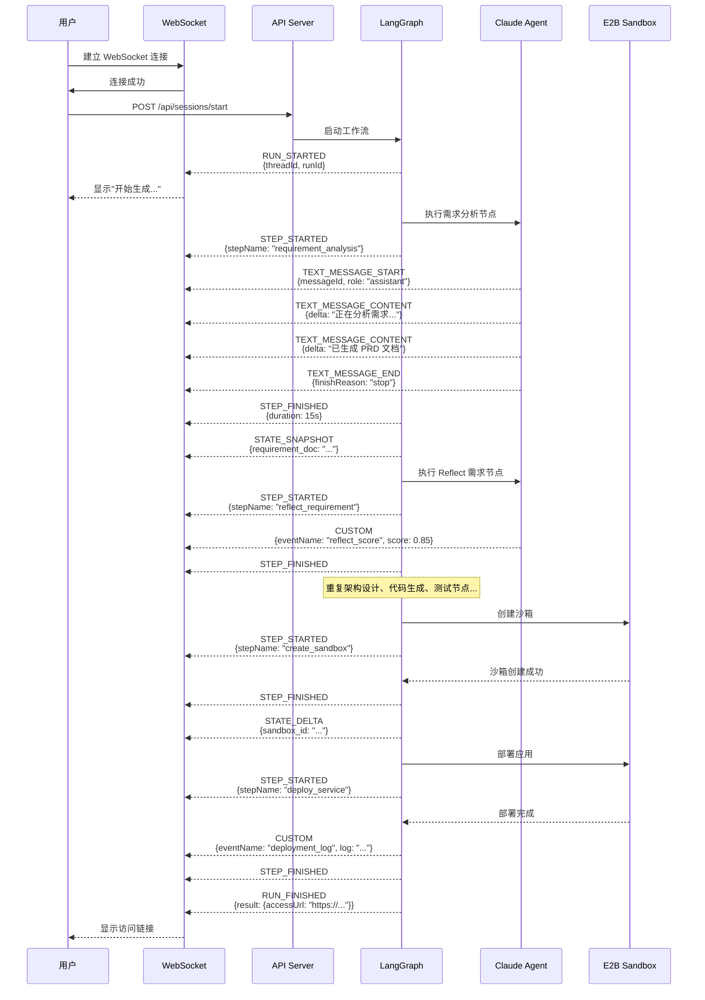

**关键时间节点**:

- T0: 用户发起请求
- T1 (+0.5s): 工作流启动，发送 RUN_STARTED
- T2 (+15s): 需求分析完成，发送 PRD 文档
- T3 (+30s): 架构设计完成
- T4 (+5min): 代码生成完成
- T5 (+8min): E2E 测试完成
- T6 (+10min): 部署完成，返回访问链接

### 7.7 WebSocket 连接规范

**连接 URL**: `wss://api.genie.app/v1/agui`

**连接生命周期**:

```
建立连接 → 认证验证 → 订阅 thread_id → 实时接收事件 → 心跳保活 → 断开重连
```

**认证流程**:

1. 客户端建立 WebSocket 连接到 `wss://api.genie.app/v1/agui`
2. 连接成功后，发送认证消息（包含 Bearer Token 和 thread_id）
3. 服务端验证 Token 有效性
4. 验证通过后，订阅对应 thread_id 的事件流

**心跳机制**:

- **Ping 间隔**: 30 秒
- **超时阈值**: 60 秒（2 次 Ping 未响应则认为连接断开）
- **自动重连**: 指数退避策略（1s, 2s, 4s, 8s, 16s, 最大 30s）

**事件顺序保证机制**:

1. **服务端侧**

   - 每个事件附加递增的序列号（sequenceNumber）
   - 按序列号顺序推送事件
2. **客户端侧重组逻辑**

   - 维护事件缓冲区（eventBuffer）
   - 按期望序列号（expectedSequence）处理事件
   - 乱序事件暂存到缓冲区，等待正确顺序
   - 处理完当前事件后，检查缓冲区中是否有后续事件可处理

**事件格式示例**:

```json
{
  "type": "TEXT_MESSAGE_CONTENT",
  "sequenceNumber": 42,
  "timestamp": "2025-11-12T10:00:05Z",
  "data": {
    "messageId": "msg_001",
    "delta": "正在分析需求..."
  }
}
```

### 7.8 错误处理和边界情况

**常见错误场景**:

1. **WebSocket 连接中断**

   ```json
   {
     "type": "RUN_ERROR",
     "data": {
       "message": "WebSocket 连接中断",
       "code": "WEBSOCKET_DISCONNECTED",
       "retryable": true
     }
   }
   ```

   **处理**: 客户端自动重连，服务端从 checkpoint 恢复状态
2. **LangGraph 节点执行失败**

   ```json
   {
     "type": "RUN_ERROR",
     "data": {
       "message": "代码生成失败: 超时",
       "code": "NODE_EXECUTION_FAILED",
       "node": "code_generation",
       "retryable": true
     }
   }
   ```

   **处理**: Reflect 节点评分 < 0.7，自动重试（最多 3 次）
3. **Agent 超时无响应**

   ```json
   {
     "type": "RUN_ERROR",
     "data": {
       "message": "Agent 超时（60 秒）",
       "code": "AGENT_TIMEOUT",
       "node": "requirement_analysis",
       "retryable": true
     }
   }
   ```

   **处理**: 中断当前 Agent 执行，保存 checkpoint，提示用户重试
4. **E2B 沙箱创建失败**

   ```json
   {
     "type": "RUN_ERROR",
     "data": {
       "message": "E2B 沙箱创建失败: 配额不足",
       "code": "SANDBOX_CREATION_FAILED",
       "node": "create_sandbox",
       "retryable": false
     }
   }
   ```

   **处理**: 工作流终止，提示用户联系管理员

**错误恢复流程**:

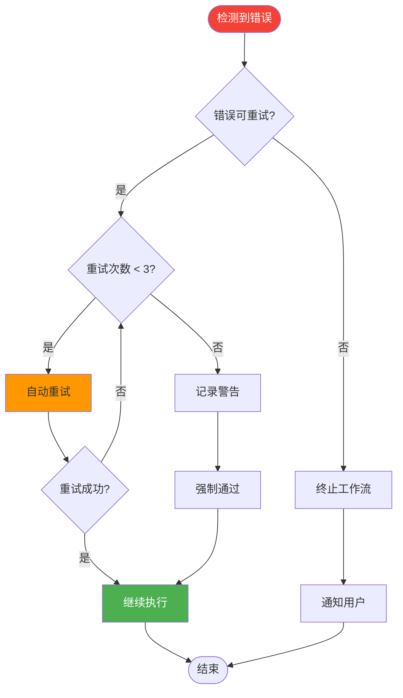

---

## 8. 非功能需求

### 8.1 性能要求

| 性能指标                      | 目标值    | 测量方法                               | 优先级 |
| ----------------------------- | --------- | -------------------------------------- | ------ |
| **单次生成时间**        | < 15 分钟 | 从需求输入到部署完成（中等复杂度应用） | P0     |
| **WebSocket 延迟**      | < 100ms   | 事件从后端发送到前端接收的延迟         | P0     |
| **Checkpoint 保存时间** | < 1 秒    | 每个节点后保存状态的时间               | P1     |
| **回滚操作时间**        | < 3 秒    | 从请求回滚到完成的时间                 | P1     |
| **并发会话数**          | ≥ 100    | 单机支持的同时活跃会话数               | P1     |
| **API 响应时间**        | < 500ms   | REST API 端点的 P95 延迟               | P2     |

**性能优化策略**:

- **Redis 缓存**: Checkpoint 优先从 Redis 读取，减少 PostgreSQL 查询
- **事件批处理**: 累积 10ms 内的事件批量发送，减少 WebSocket 开销
- **代码生成优化**: 使用模板和代码片段加速生成过程
- **并行执行**: E2B 沙箱创建和代码生成部分重叠

### 8.2 可靠性要求

| 可靠性指标                | 目标                                       | 实现方式                             |
| ------------------------- | ------------------------------------------ | ------------------------------------ |
| **断点续传**        | 支持网络中断后自动重连并恢复状态           | WebSocket 自动重连 + Checkpoint 恢复 |
| **错误重试**        | 节点执行失败时自动重试（最多 3 次）        | Reflect 评分 < 0.7 触发重试          |
| **数据持久化**      | 所有 AgentState 和 Messages 持久化到数据库 | PostgreSQL 存储所有 Checkpoint       |
| **Checkpoint 备份** | 每个节点后自动保存 checkpoint              | LangGraph Checkpointer 机制          |
| **服务可用性**      | 99.5% uptime（每月最多 3.6 小时停机）      | 多实例部署 + 健康检查                |

**故障恢复流程**:

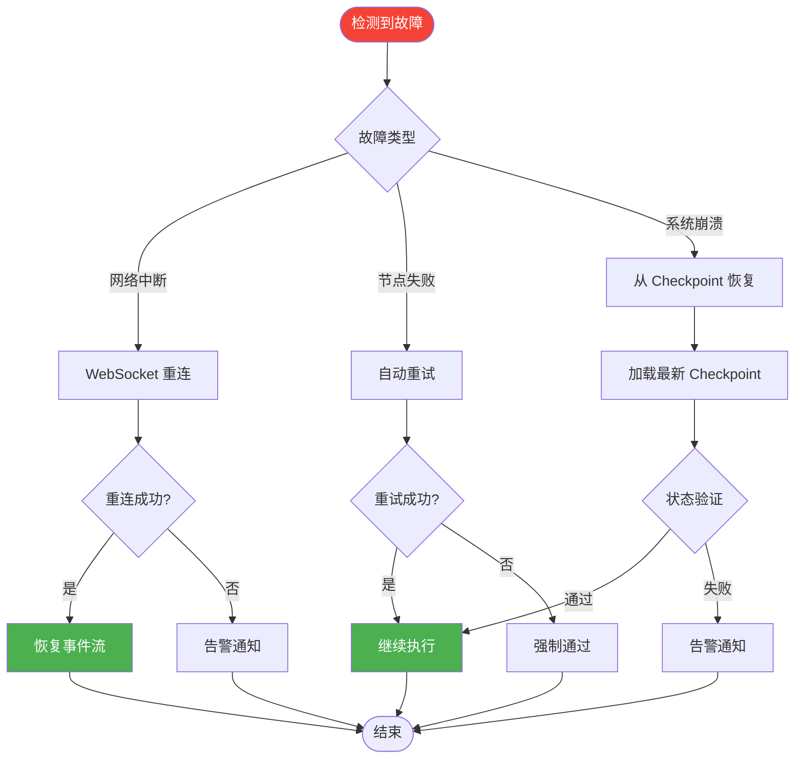

### 8.3 安全性要求

| 安全指标               | 要求                                      | 实现方式                        |
| ---------------------- | ----------------------------------------- | ------------------------------- |
| **沙箱隔离**     | 所有代码在 E2B 沙箱中执行，与主机隔离     | E2B Sandbox 虚拟化环境          |
| **代码审计**     | 生成的代码通过 Linter 和 SAST 工具检查    | Reflect 节点集成 Semgrep/Bandit |
| **敏感信息过滤** | 自动检测并过滤 API Key、密码等敏感信息    | 正则表达式 + 熵检测             |
| **认证授权**     | 所有 API 请求需要 Bearer Token            | FastAPI 依赖注入 + JWT 验证     |
| **数据加密**     | 传输加密（HTTPS/WSS）+ 存储加密（数据库） | TLS 1.3 + PostgreSQL 列加密     |

**安全检查清单**:

- [ ] E2B 沙箱网络隔离（禁止访问内网）
- [ ] 生成代码中无硬编码密钥
- [ ] 用户输入经过 XSS/SQL 注入防护
- [ ] WebSocket 连接强制认证
- [ ] 敏感日志脱敏处理

### 8.4 可观测性要求

| 可观测性维度       | 工具          | 监控指标                                |
| ------------------ | ------------- | --------------------------------------- |
| **日志系统** | Structlog     | 节点输入输出、执行时间、错误堆栈        |
| **Metrics**  | Prometheus    | Token 使用量、API 调用次数、错误率      |
| **Tracing**  | OpenTelemetry | 分布式追踪（LangGraph → Agent → E2B） |
| **告警**     | Alertmanager  | 错误率 > 5%、延迟 > 2min、可用性 < 99%  |

**关键监控指标**:

| 指标名称                               | 说明                  | 标签                                     |
| -------------------------------------- | --------------------- | ---------------------------------------- |
| genie_workflow_duration_seconds        | 工作流总执行时间      | -                                        |
| genie_node_duration_seconds            | 各节点执行时间        | node（节点名称）                         |
| genie_token_usage_total                | Token 使用量          | node（节点名称）                         |
| genie_api_requests_total               | API 请求总数          | endpoint（端点路径）                     |
| genie_errors_total                     | 错误总数              | node（节点名称）、error_type（错误类型） |
| genie_checkpoint_save_duration_seconds | Checkpoint 保存时间   | -                                        |
| genie_websocket_connections_active     | 活跃 WebSocket 连接数 | -                                        |

### 8.5 可扩展性要求

| 扩展性维度           | 目标                                        | 实现方式                    |
| -------------------- | ------------------------------------------- | --------------------------- |
| **水平扩展**   | 支持通过增加服务器节点提升并发能力          | 无状态设计 + Redis 共享存储 |
| **插件机制**   | 支持添加新的智能体类型和 MCP 工具           | 插件注册器 + 动态加载       |
| **多语言支持** | 架构支持扩展到其他编程语言（Java、Go 等）   | 模板化代码生成 + 语言检测   |
| **多模型支持** | 支持切换不同的 LLM 模型（GPT-4、Gemini 等） | 模型适配器模式              |

**扩展点设计**:

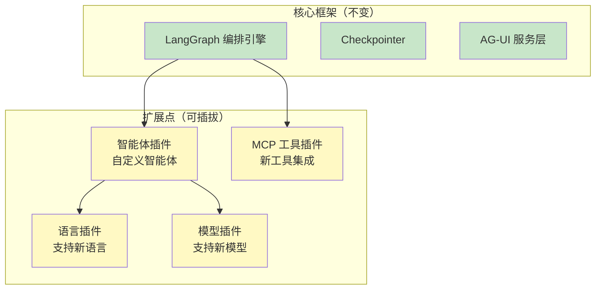

---

## 9. 风险与限制

### 9.1 技术风险

| 风险                                        | 影响                   | 概率 | 缓解措施                                                   | 责任人     |
| ------------------------------------------- | ---------------------- | ---- | ---------------------------------------------------------- | ---------- |
| **LLM 生成代码质量不稳定**            | 生成的代码可能存在 bug | 高   | 1. 多层 Reflect 评估 ``2. 自动化测试``3. 限制项目复杂度    | 技术负责人 |
| **E2B 沙箱过期（12小时）**            | 用户链接失效           | 中   | 1. 提醒用户沙箱时效 ``2. 提供导出代码功能``3. 支持重新部署 | 产品经理   |
| **Reflect 循环导致长时间执行**        | 用户等待时间过长       | 中   | 1. 设置最大重试次数（3次）``2. 允许用户跳过 Reflect        | 技术负责人 |
| **LangGraph checkpoint 存储膨胀**     | 数据库存储压力         | 低   | 1. 定期清理旧 checkpoint``2. 压缩存储格式                  | DevOps     |
| **Claude Agent SDK interrupt() 限制** | 只能在流式模式中断     | 低   | 1. 确保所有智能体使用流式模式``2. 结合 LangGraph 节点检查  | 技术负责人 |

**风险监控指标**:

- 代码质量评分 < 0.6 的比例（目标 < 10%）
- 平均生成时间（目标 < 15 分钟）
- Checkpoint 存储增长速率（目标 < 10GB/月）
- 中断响应时间（目标 < 3 秒）

### 9.2 业务风险

| 风险                     | 影响           | 概率 | 缓解措施                                             |
| ------------------------ | -------------- | ---- | ---------------------------------------------------- |
| **LLM API 成本高** | 运营成本压力   | 高   | 1. 实现 token 限制 ``2. 缓存常见需求``3. 优化 prompt |
| **用户期望过高**   | 用户满意度下降 | 中   | 1. 明确功能边界``2. 提供示例和最佳实践               |

### 9.3 当前限制

**v1.0 版本的限制**:

1. **项目复杂度**

   - 适用于中小型应用（< 10 个文件，< 2000 行代码）
   - 不适合大型企业级应用或微服务架构
2. **技术栈**

   - 当前支持 React + FastAPI/Express
   - 未来扩展: Vue、Angular、Django、Spring Boot
3. **部署环境**

   - 仅支持 E2B 沙箱部署
   - 不支持自定义服务器或云平台（AWS、Azure、GCP）
4. **多人协作**

   - v1.0 不支持多用户协作编辑同一项目
   - 未来版本考虑 Git 分支协作
5. **实时预览**

   - 代码生成过程中不提供实时预览
   - 需等待完整生成和部署后查看

**功能对比表**:

| 功能             | v1.0 支持             | v2.0 规划            |
| ---------------- | --------------------- | -------------------- |
| 自然语言需求输入 | ✅                    | ✅                   |
| 多轮对话澄清     | ✅                    | ✅                   |
| PRD 自动生成     | ✅                    | ✅                   |
| 架构自动设计     | ✅                    | ✅                   |
| 代码生成         | ✅（React + FastAPI） | ✅（扩展更多栈）     |
| 自动化测试       | ✅（E2E）             | ✅（E2E + 单元测试） |
| E2B 沙箱部署     | ✅                    | ✅                   |
| 自定义云平台部署 | ❌                    | ✅                   |
| 中断与恢复       | ✅                    | ✅                   |
| 会话回滚         | ✅                    | ✅                   |
| 实时进度推送     | ✅                    | ✅                   |
| 实时代码预览     | ❌                    | ✅                   |
| 多人协作         | ❌                    | ✅                   |
| 语音输入         | ❌                    | ✅                   |

---

## 10. 附录

### 10.1 术语表

| 术语                       | 英文全称                              | 定义                                                   |
| -------------------------- | ------------------------------------- | ------------------------------------------------------ |
| **AG-UI Protocol**   | Agent-User Interaction Protocol       | 标准化的智能体与前端通信协议，由 CopilotKit 开发       |
| **LangGraph**        | -                                     | LangChain 出品的图编排框架，用于构建复杂的智能体工作流 |
| **Reflect 节点**     | Reflection Node                       | 质量评估节点，负责评估上一个智能体的输出并决定是否重试 |
| **Checkpoint**       | -                                     | LangGraph 的状态快照机制，用于断点续传和回滚           |
| **E2B Sandbox**      | E2B Sandbox                           | 云端代码执行环境，提供隔离的运行环境                   |
| **Claude Agent SDK** | Claude Agent Software Development Kit | Anthropic 官方的 Claude 智能体开发工具包               |
| **MCP**              | Model Context Protocol                | 智能体工具调用标准协议                                 |
| **会话轮次**         | Session Round                         | 用户每次提交需求或修改意见算一轮                       |
| **AgentState**       | -                                     | LangGraph 工作流的核心状态对象，包含所有中间结果       |

### 10.2 参考文档

**官方文档**:

- [AG-UI Protocol 官方文档](https://docs.ag-ui.com/introduction)
- [LangGraph 官方文档](https://langchain-ai.github.io/langgraph/)
- [Claude Agent SDK Python](https://docs.claude.com/zh-CN/docs/agent-sdk/python)
- [E2B Python SDK](https://e2b.dev/docs/sdk-reference/python-sdk/v2.6.4/sandbox_async)

**技术博客**:

- [AG-UI: The Agent-User Interaction Protocol](https://www.copilotkit.ai/ag-ui)
- [LangGraph: Building Stateful Multi-Agent Applications](https://blog.langchain.dev/langgraph-multi-agent/)

**MCP 工具文档**:

- [Playwright MCP](https://github.com/microsoft/playwright-python)
- [Sequential Thinking MCP](https://modelcontextprotocol.io/tools/sequential-thinking)
- [Context7 MCP](https://context7.ai/docs)

### 10.3 文档变更历史

| 版本   | 日期       | 变更说明                          | 作者    |
| ------ | ---------- | --------------------------------- | ------- |
| v1.0.0 | 2025-11-12 | 初版会议演示文档，基于 PRD v1.0.0 | AI Team |

---
